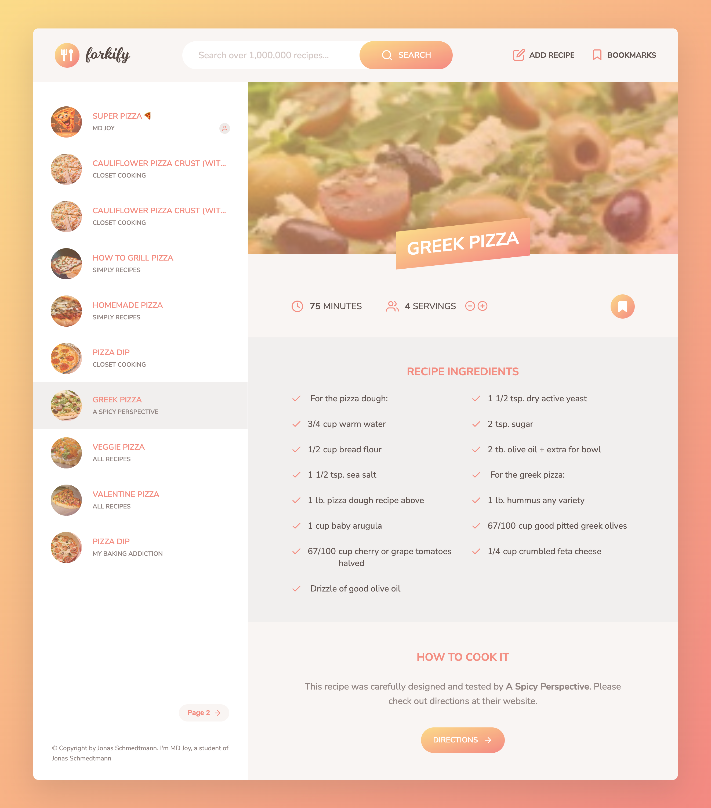

<div align="center">
  


  
</div>

## 𝗧𝗵𝗶𝘀 𝗽𝗿𝝾ᒍ𝗲𝗰𝘁 𝗶𝘀 𝗯𝗮𝘀𝗲𝗱 𝝾𝗻 ᒍ𝝾𝗻𝗮𝘀 𝗦𝗰𝗵𝗺𝗲𝗱𝘁𝗺𝗮𝗻𝗻'𝘀 [𝝖𝗱𝝼𝗮𝗻𝗰𝗲𝗱 ᒍ𝗮𝝼𝗮𝗦𝗰𝗿𝗶𝗽𝘁](https://www.udemy.com/user/jonasschmedtmann/) 𝗰𝝾𝞄𝗿𝘀𝗲. 𝝪𝝾𝞄 𝘀𝗵𝝾𝞄𝗹𝗱 𝗰𝗵𝗲𝗰𝗸 𝗵𝗶𝘀 𝗰𝝾𝞄𝗿𝘀𝗲. 𝝖𝗹𝗹 𝘁𝗵𝗲 𝗰𝗿𝗲𝗱𝗶𝘁𝘀 𝗴𝝾 𝘁𝝾 𝗺𝝲 𝗯𝗲𝗮𝞄𝘁𝗶𝗳𝞄𝗹 𝘁𝗲𝗮𝗰𝗵𝗲𝗿 ᒍ𝝾𝗻𝗮𝘀 𝗦𝗰𝗵𝗺𝗲𝗱𝘁𝗺𝗮𝗻𝗻--

<!-- PROJECT LOGO -->
<br />
<div align="center">
  <a href="#">
    
  </a>
  <h1 align="center">𝗙𝝾𝗿𝗸𝗶𝗳𝝲-𝝖𝗽𝗽</h1>

  <p align="center">
    <a href="https://forkify-app-phoenix46.netlify.app/">✅ 𝗩𝗶𝗲𝞈 𝗱𝗲𝗺𝝾</a>
    <br/>
    <a href="https://github.com/pH0enix46/Forkify-App---JAVASCRIPT/issues">🐛 𝗕𝞄𝗴 𝗿𝗲𝗽𝝾𝗿𝘁</a>
  </p>
  </div>

## 𝝖𝗯𝝾𝞄𝘁 𝗧𝗵𝗲 𝗣𝗿𝝾𝗷𝗲𝗰𝘁
𝗙𝝾𝗿𝗸𝗶𝗳𝝲 𝗶𝘀 𝗮 𝗿𝗲𝗰𝗶𝗽𝗲 𝞈𝗲𝗯 𝗮𝗽𝗽 𝞄𝘀𝗶𝗻𝗴 𝘁𝗵𝗲 [𝗙𝝾𝗿𝗸𝗶𝗳𝝲 𝝖𝗣𝗜](https://forkify-api.herokuapp.com/v2) 𝘁𝝾 𝗮𝝞𝝞𝝾𝞈 𝞄𝘀𝗲𝗿𝘀 𝘁𝝾 𝘀𝗲𝗮𝗿𝗰𝗵, 𝝼𝗶𝗲𝞈, 𝗺𝝾𝗱𝗶𝗳𝝲, 𝗯𝝾𝝾𝗸𝗺𝗮𝗿𝗸 𝗮𝗻𝗱 𝗮𝗱𝗱 𝗿𝗲𝗰𝗶𝗽𝗲𝘀. 𝗜 𝗮𝗺 𝗱𝝾𝗶𝗻𝗴 𝗮𝗹𝗹 𝘁𝗵𝗲 𝗰𝝾𝗱𝗲 𝗺𝗮𝗻𝞄𝗮𝗹𝗹𝝲. 𝗣𝗹𝗲𝗮𝘀𝗲 𝗰𝗵𝗲𝗰𝗸 𝘁𝗵𝗲 𝗰𝝾𝗱𝗲
<br/>
𝗧𝗵𝗶𝘀 𝗽𝗿𝝾𝗷𝗲𝗰𝘁 𝘀𝗵𝝾𝞈𝗰𝗮𝘀𝗲𝘀 𝗺𝝾𝗱𝗲𝗿𝗻 𝗝𝗮𝝼𝗮𝗦𝗰𝗿𝗶𝗽𝘁 𝘁𝗵𝗿𝝾𝞄𝗴𝗵 𝘁𝗵𝗲 𝞄𝘀𝗲 𝝾𝗳 𝗳𝞄𝗻𝗰𝘁𝗶𝝾𝗻𝗮𝝞 𝗽𝗿𝝾𝗴𝗿𝗮𝗺𝗺𝗶𝗻𝗴 𝗮𝗻𝗱 𝝾𝗯𝗷𝗲𝗰𝘁-𝝾𝗿𝗶𝗲𝗻𝘁𝗲𝗱 𝗽𝗿𝝾𝗴𝗿𝗮𝗺𝗺𝗶𝗻𝗴 (𝝤𝝤𝗣) 𝗽𝗮𝗿𝗮𝗱𝗶𝗴𝗺𝘀, 𝗽𝗿𝝾𝗺𝝾𝘁𝗶𝗻𝗴 𝗰𝝞𝗲𝗮𝗻 𝗮𝗻𝗱 𝗺𝗮𝗶𝗻𝘁𝗮𝗶𝗻𝗮𝗯𝝞𝗲 𝗰𝝾𝗱𝗲. 𝗜𝘁 𝗲𝗺𝗽𝝞𝝾𝝲𝘀 𝗮𝘀𝝲𝗻𝗰𝗵𝗿𝝾𝗻𝝾𝞄𝘀 𝗳𝞄𝗻𝗰𝘁𝗶𝝾𝗻𝘀 𝞈𝗶𝘁𝗵 𝗮𝘀𝝲𝗻𝗰/𝗮𝞈𝗮𝗶𝘁 𝗳𝝾𝗿 𝘀𝗲𝗮𝗺𝝞𝗲𝘀𝘀 𝗱𝗮𝘁𝗮 𝗳𝗲𝘁𝗰𝗵𝗶𝗻𝗴, 𝗲𝗻𝗵𝗮𝗻𝗰𝗶𝗻𝗴 𝘁𝗵𝗲 𝞄𝘀𝗲𝗿 𝗲𝘅𝗽𝗲𝗿𝗶𝗲𝗻𝗰𝗲. 𝗟𝗲𝝼𝗲𝗿𝗮𝗴𝗶𝗻𝗴 𝗘𝗦6+ 𝗳𝗲𝗮𝘁𝞄𝗿𝗲𝘀 𝘀𝞄𝗰𝗵 𝗮𝘀 𝗺𝝾𝗱𝞄𝝞𝗲𝘀, 𝗮𝗿𝗿𝝾𝞈 𝗳𝞄𝗻𝗰𝘁𝗶𝝾𝗻𝘀, 𝗺𝗮𝗽 𝗮𝗻𝗱 𝗱𝗲𝘀𝘁𝗿𝞄𝗰𝘁𝞄𝗿𝗶𝗻𝗴, 𝘁𝗵𝗲 𝗽𝗿𝝾𝗷𝗲𝗰𝘁 𝗶𝘀 𝝾𝗿𝗴𝗮𝗻𝗶𝘇𝗲𝗱 𝗮𝗻𝗱 𝗲𝗮𝘀𝝲 𝘁𝝾 𝗿𝗲𝗮𝗱. 𝝤𝝼𝗲𝗿𝗮𝝞𝝞, 𝗰𝝾𝗺𝗯𝗶𝗻𝗲𝘀 𝘁𝗵𝗲𝘀𝗲 𝗮𝗱𝝼𝗮𝗻𝗰𝗲𝗱 𝘁𝗲𝗰𝗵𝗻𝗶𝗾𝞄𝗲𝘀 𝘁𝝾 𝗰𝗿𝗲𝗮𝘁𝗲 𝗮𝗻 𝗶𝗻𝘁𝗲𝗿𝗮𝗰𝘁𝗶𝝼𝗲 𝗮𝗻𝗱 𝗿𝗲𝘀𝗽𝝾𝗻𝘀𝗶𝝼𝗲 𝗿𝗲𝗰𝗶𝗽𝗲 𝗮𝗽𝗽𝝞𝗶𝗰𝗮𝘁𝗶𝝾𝗻



### 𝗙𝗲𝗮𝘁𝞄𝗿𝗲𝘀

| 𝗨𝘀𝗲𝗿 𝗦𝘁𝝾𝗿𝗶𝗲𝘀                                                               | 𝗙𝗲𝗮𝘁𝞄𝗿𝗲𝘀                                                                                                                                                                              |
| -------------------------------------------------------------------------- | ------------------------------------------------------------------------------------------------------------------------------------------------------------------------------------- |
| 𝗦𝗲𝗮𝗿𝗰𝗵 𝗳𝝾𝗿 𝗿𝗲𝗰𝗶𝗽𝗲𝘀                                                         | 𝗜𝗻𝗽𝞄𝘁 𝗳𝗶𝗲𝝞𝗱 𝗳𝝾𝗿 𝝖𝗣𝗜 𝗿𝗲𝗾𝞄𝗲𝘀𝘁𝘀 𝞈𝗶𝘁𝗵 𝘀𝗲𝗮𝗿𝗰𝗵 𝗸𝗲𝝲𝞈𝝾𝗿𝗱𝘀𝗣𝗮𝗴𝗶𝗻𝗮𝘁𝗲𝗱 𝗿𝗲𝘀𝞄𝝞𝘁𝘀 𝗱𝗶𝘀𝗽𝝞𝗮𝝲𝗥𝗲𝗰𝗶𝗽𝗲 𝗱𝗲𝘁𝗮𝗶𝝞𝘀 𝞈𝗶𝘁𝗵 𝗰𝝾𝝾𝗸𝗶𝗻𝗴 𝘁𝗶𝗺𝗲, 𝘀𝗲𝗿𝝼𝗶𝗻𝗴𝘀, 𝗮𝗻𝗱 𝗶𝗻𝗴𝗿𝗲𝗱𝗶𝗲𝗻𝘁𝘀 |
| 𝗨𝗽𝗱𝗮𝘁𝗲 𝘁𝗵𝗲 𝗻𝞄𝗺𝗯𝗲𝗿 𝝾𝗳 𝘀𝗲𝗿𝝼𝗶𝗻𝗴𝘀                                              | 𝝖𝗱𝗷𝞄𝘀𝘁 𝗶𝗻𝗴𝗿𝗲𝗱𝗶𝗲𝗻𝘁 𝗮𝗺𝝾𝞄𝗻𝘁𝘀 𝗯𝗮𝘀𝗲𝗱 𝝾𝗻 𝗰𝞄𝗿𝗿𝗲𝗻𝘁 𝘀𝗲𝗿𝝼𝗶𝗻𝗴𝘀                                                                             |
| 𝝗𝝾𝝾𝗸𝗺𝗮𝗿𝗸 𝗿𝗲𝗰𝗶𝗽𝗲𝘀                                                           | 𝗗𝗶𝘀𝗽𝝞𝗮𝝲 𝗮 𝝞𝗶𝘀𝘁 𝝾𝗳 𝗮𝝞𝝞 𝗯𝝾𝝾𝗸𝗺𝗮𝗿𝗸𝗲𝗱 𝗿𝗲𝗰𝗶𝗽𝗲𝘀                                                                                                  |
| 𝗖𝗿𝗲𝗮𝘁𝗲 𝗿𝗲𝗰𝗶𝗽𝗲𝘀                                                             | 𝗨𝘀𝗲𝗿𝘀 𝗰𝗮𝗻 𝞄𝗽𝝞𝝾𝗮𝗱 𝗮𝗻𝗱 𝗺𝗮𝗻𝗮𝗴𝗲 𝘁𝗵𝗲𝗶𝗿 𝝾𝞈𝗻 𝗿𝗲𝗰𝗶𝗽𝗲𝘀𝗨𝘀𝗲𝗿 𝗿𝗲𝗰𝗶𝗽𝗲𝘀 𝗮𝗿𝗲 𝗮𝞄𝘁𝝾-𝗯𝝾𝝾𝗸𝗺𝗮𝗿𝗸𝗲𝗱𝗨𝘀𝗲𝗿𝘀 𝗰𝗮𝗻 𝝾𝗻𝝞𝝲 𝝼𝗶𝗲𝞈 𝘁𝗵𝗲𝗶𝗿 𝝾𝞈𝗻 𝗿𝗲𝗰𝗶𝗽𝗲𝘀            |
| 𝝖𝗰𝗰𝗲𝘀𝘀 𝘁𝝾 𝗯𝝾𝝾𝗸𝗺𝗮𝗿𝗸𝘀 𝗮𝗻𝗱 𝗿𝗲𝗰𝗶𝗽𝗲𝘀 𝞈𝗵𝗲𝗻 𝝞𝗲𝗮𝝼𝗶𝗻𝗴 𝘁𝗵𝗲 𝗮𝗽𝗽 𝗮𝗻𝗱 𝗰𝝾𝗺𝗶𝗻𝗴 𝗯𝗮𝗰𝗸 𝝞𝗮𝘁𝗲𝗿 | 𝗦𝘁𝝾𝗿𝗲 𝗯𝝾𝝾𝗸𝗺𝗮𝗿𝗸𝘀 𝞄𝘀𝗶𝗻𝗴 𝝞𝝾𝗰𝗮𝝞 𝘀𝘁𝝾𝗿𝗮𝗴𝗲 𝗳𝝾𝗿 𝗲𝗮𝘀𝝲 𝗮𝗰𝗰𝗲𝘀𝘀 𝝞𝗮𝘁𝗲𝗿     


### 𝗙𝝞𝝾𝞈𝗰𝗵𝗮𝗿𝘁


### 𝝖𝗿𝗰𝗵𝗶𝘁𝗲𝗰𝘁𝞄𝗿𝗲


#### 𝗧𝗿𝗲𝗲 𝘀𝘁𝗿𝞄𝗰𝘁𝞄𝗿𝗲

```
forkify
│   .gitignore
│   index.html
│   package-lock.json
│   package.json
│   README.md
│
└───src
    ├───img
    │       favicon.png
    │       icons.svg
    │       logo.png
    │
    ├───js
    │   │   config.js
    │   │   controller.js
    │   │   helpers.js
    │   │   model.js
    │   │
    │   └───views
    │           addRecipeView.js
    │           bookmarksView.js
    │           paginationView.js
    │           previewView.js
    │           recipeView.js
    │           resultsView.js
    │           searchView.js
    │           view.js
    │
    └───sass
            main.scss
            _base.scss
            _components.scss
            _header.scss
            _preview.scss
            _recipe.scss
            _searchResults.scss
            _upload.scss
```


✅ 𝗘𝗻ᒍ𝝾𝝲! 𝗳𝝾𝗿 𝗹𝗲𝗮𝗿𝗻𝗶𝗻𝗴 
<br/>
❌ 𝗕𝞄𝘁 𝗱𝝾𝗻'𝘁 𝗰𝝾𝗽𝝲 𝗺𝗶𝗻𝗲

## 𝝖𝗰𝗸𝗻𝝾𝞈𝗹𝗲𝗱𝗴𝗺𝗲𝗻𝘁𝘀
𝗠𝝲 𝗹𝝾𝝼𝗲𝗹𝝲 𝘁𝗲𝗮𝗰𝗵𝗲𝗿 [ᒍ𝝾𝗻𝗮𝘀 𝗦𝗰𝗵𝗺𝗲𝗱𝘁𝗺𝗮𝗻𝗻](https://github.com/jonasschmedtmann)


```
𝗛𝗮𝝼𝗲 𝗮 𝗻𝗶𝗰𝗲 𝗗𝗮𝝲!😸
```
