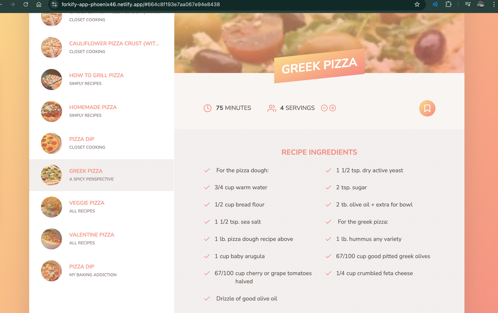

  

  

 
 
<!-- PROJECT LOGO -->
 

  
  <h1 align="center">𝗙𝝾𝗿𝗸𝗶𝗳𝝲-𝝖𝗽𝗽</h1>

  

    <a href="https://forkify-app-phoenix46.netlify.app/">✅ 𝗩𝗶𝗲𝞈 𝗱𝗲𝗺𝝾</a>
     
    <a href="https://github.com/pH0enix46/Forkify-App---JAVASCRIPT/issues">🐛 𝗕𝞄𝗴 𝗿𝗲𝗽𝝾𝗿𝘁</a>
  

  

## About The Project
𝗙𝝾𝗿𝗸𝗶𝗳𝝲 𝗶𝘀 𝗮 𝗿𝗲𝗰𝗶𝗽𝗲 𝞈𝗲𝗯 𝗮𝗽𝗽 𝞄𝘀𝗶𝗻𝗴 𝘁𝗵𝗲 [𝗙𝝾𝗿𝗸𝗶𝗳𝝲 𝝖𝗣𝗜](https://forkify-api.herokuapp.com/v2) 𝘁𝝾 𝗮𝝞𝝞𝝾𝞈 𝞄𝘀𝗲𝗿𝘀 𝘁𝝾 𝘀𝗲𝗮𝗿𝗰𝗵, 𝝼𝗶𝗲𝞈, 𝗺𝝾𝗱𝗶𝗳𝝲, 𝗯𝝾𝝾𝗸𝗺𝗮𝗿𝗸 𝗮𝗻𝗱 𝗮𝗱𝗱 𝗿𝗲𝗰𝗶𝗽𝗲𝘀. 𝗜 𝗮𝗺 𝗱𝝾𝗶𝗻𝗴 𝗮𝗹𝗹 𝘁𝗵𝗲 𝗰𝝾𝗱𝗲 𝗺𝗮𝗻𝞄𝗮𝗹𝗹𝝲. 𝗣𝗹𝗲𝗮𝘀𝗲 𝗰𝗵𝗲𝗰𝗸 𝘁𝗵𝗲 𝗰𝝾𝗱𝗲
 
𝗧𝗵𝗶𝘀 𝗽𝗿𝝾𝗷𝗲𝗰𝘁 𝘀𝗵𝝾𝞈𝗰𝗮𝘀𝗲𝘀 𝗺𝝾𝗱𝗲𝗿𝗻 𝗝𝗮𝝼𝗮𝗦𝗰𝗿𝗶𝗽𝘁 𝘁𝗵𝗿𝝾𝞄𝗴𝗵 𝘁𝗵𝗲 𝞄𝘀𝗲 𝝾𝗳 𝗳𝞄𝗻𝗰𝘁𝗶𝝾𝗻𝗮𝝞 𝗽𝗿𝝾𝗴𝗿𝗮𝗺𝗺𝗶𝗻𝗴 𝗮𝗻𝗱 𝝾𝗯𝗷𝗲𝗰𝘁-𝝾𝗿𝗶𝗲𝗻𝘁𝗲𝗱 𝗽𝗿𝝾𝗴𝗿𝗮𝗺𝗺𝗶𝗻𝗴 (𝝤𝝤𝗣) 𝗽𝗮𝗿𝗮𝗱𝗶𝗴𝗺𝘀, 𝗽𝗿𝝾𝗺𝝾𝘁𝗶𝗻𝗴 𝗰𝝞𝗲𝗮𝗻 𝗮𝗻𝗱 𝗺𝗮𝗶𝗻𝘁𝗮𝗶𝗻𝗮𝗯𝝞𝗲 𝗰𝝾𝗱𝗲. 𝗜𝘁 𝗲𝗺𝗽𝝞𝝾𝝲𝘀 𝗮𝘀𝝲𝗻𝗰𝗵𝗿𝝾𝗻𝝾𝞄𝘀 𝗳𝞄𝗻𝗰𝘁𝗶𝝾𝗻𝘀 𝞈𝗶𝘁𝗵 𝗮𝘀𝝲𝗻𝗰/𝗮𝞈𝗮𝗶𝘁 𝗳𝝾𝗿 𝘀𝗲𝗮𝗺𝝞𝗲𝘀𝘀 𝗱𝗮𝘁𝗮 𝗳𝗲𝘁𝗰𝗵𝗶𝗻𝗴, 𝗲𝗻𝗵𝗮𝗻𝗰𝗶𝗻𝗴 𝘁𝗵𝗲 𝞄𝘀𝗲𝗿 𝗲𝘅𝗽𝗲𝗿𝗶𝗲𝗻𝗰𝗲. 𝗟𝗲𝝼𝗲𝗿𝗮𝗴𝗶𝗻𝗴 𝗘𝗦6+ 𝗳𝗲𝗮𝘁𝞄𝗿𝗲𝘀 𝘀𝞄𝗰𝗵 𝗮𝘀 𝗺𝝾𝗱𝞄𝝞𝗲𝘀, 𝗮𝗿𝗿𝝾𝞈 𝗳𝞄𝗻𝗰𝘁𝗶𝝾𝗻𝘀, 𝗺𝗮𝗽 𝗮𝗻𝗱 𝗱𝗲𝘀𝘁𝗿𝞄𝗰𝘁𝞄𝗿𝗶𝗻𝗴, 𝘁𝗵𝗲 𝗽𝗿𝝾𝗷𝗲𝗰𝘁 𝗶𝘀 𝝾𝗿𝗴𝗮𝗻𝗶𝘇𝗲𝗱 𝗮𝗻𝗱 𝗲𝗮𝘀𝝲 𝘁𝝾 𝗿𝗲𝗮𝗱. 𝝤𝝼𝗲𝗿𝗮𝝞𝝞, 𝗰𝝾𝗺𝗯𝗶𝗻𝗲𝘀 𝘁𝗵𝗲𝘀𝗲 𝗮𝗱𝝼𝗮𝗻𝗰𝗲𝗱 𝘁𝗲𝗰𝗵𝗻𝗶𝗾𝞄𝗲𝘀 𝘁𝝾 𝗰𝗿𝗲𝗮𝘁𝗲 𝗮𝗻 𝗶𝗻𝘁𝗲𝗿𝗮𝗰𝘁𝗶𝝼𝗲 𝗮𝗻𝗱 𝗿𝗲𝘀𝗽𝝾𝗻𝘀𝗶𝝼𝗲 𝗿𝗲𝗰𝗶𝗽𝗲 𝗮𝗽𝗽𝝞𝗶𝗰𝗮𝘁𝗶𝝾𝗻

